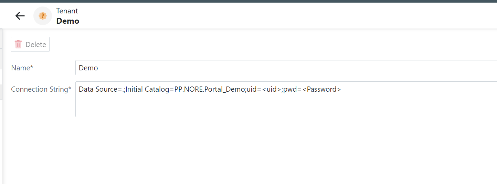

# NORE (None Opinionated Rating Engine)

## What is NORE?
So what is NORE? NORE stands for None Opinionated Rating Engine (of course there are some level of opinionated views, but not from a product point of view) with the aim to provide a flexible and very fast way to allow users be able to setup new product(s). NORE is a only a Rating Engine and only replaces the Blaze Rating Engine service.

## Key Problems Trying To Resolve

1. Reduced dependencies on Engineers.
2. Flexible Rating Engine
3. High return on ROI
4. Improved Debugging (consistent experience in all environments)
5. No direct dependencies on database and/or services.

### Phases

1. Phase 1 - POC (current state)
2. Phase 2 - Productionize 
3. Phase 3 - Design and developer a more advance user interface / flow

- [ ] ### Improve Error handling Reporting (Phase 1)

- [ ] Add security boundaries around Build and Ratings (limit access to resources like network, file etc) (Phase 1)

- [ ] Improve code quality (Phase 2)

- [ ] Add Unit and Integration Tests (Phase 2)

## Key Benefits
The system removes the need for Engineers, allowing users to operate independently and make necessary adjustments without requiring technical assistance. It also reduces reliance on Business Analysts (BAs), empowering users to configure, test, and validate changes in real time without the need for deployment or publishing updates. This capability creates a more agile and responsive environment, where adjustments can be made swiftly to meet business needs.

Security remains a top priority, with each user managing their own data storage and security access. Users can control their own user base, ensuring data remains separated across instances. Each user operates within a secure, dedicated database, eliminating the need for DevOps or Engineering teams to manage these aspects. This autonomy enhances both security and customization, tailored to the specific needs of each user.

With factors, configurations, and logic all managed directly through the portal, users have greater flexibility. New factors and algorithms can be introduced without following predefined rules, allowing for innovation and the creation of new offerings that do not yet exist in the market. This flexibility supports the development and testing of unique products within the system.

## Core Features
- Multiple Tenants managed via portal
- Create Products
    - Define Decisions (Availability, Decline, Referral, Risk rules)
    - Uploaded Data Models
    - Add Steps and Factors
    - Add Product Tests
    - Sections
- Create Sub Products
    - Based on Core Product
    - Add additional rules, factors etc
    - Overwrite core product rule(s)
- Validate Rating via portal in real time
- Shared Decisions

## Workflow

## Architecture

### Prerequisites
- Visual Studio 2022
- DevExpress XAF Framework (license or trial required)
- SQL Server

### Running the application
Open PP.NORE.sln and validate the database connection string is correct that points to a local Sql server (must have rights to create databases).
Run the app in debug mode (F5) and you will be presented with the following screen:

Username: admin
Password: <leave blank>

You will now need to create a Tenant, click on Tenants and you will be present with the following screen:

Click on the New button and enter the name of the Tenant and a valid Database connection string:

Click on Save and Log out.

Now login as the Tenant, the username will be admin@demo and no password.
